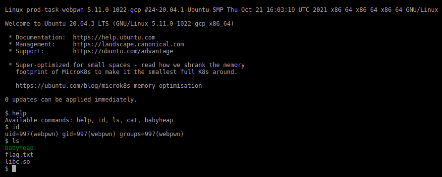
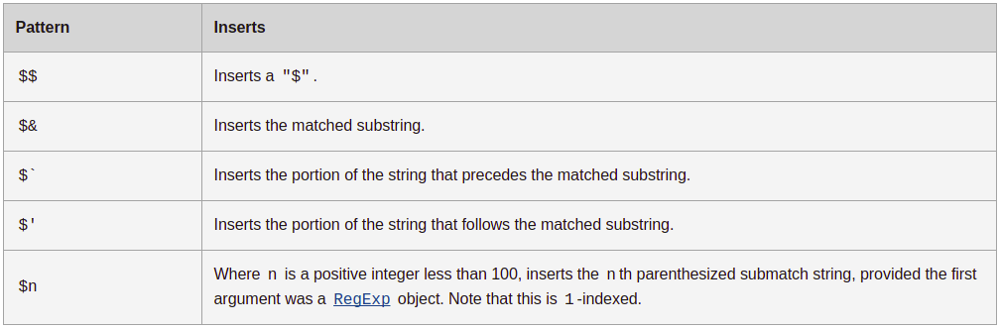
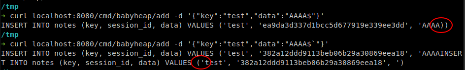
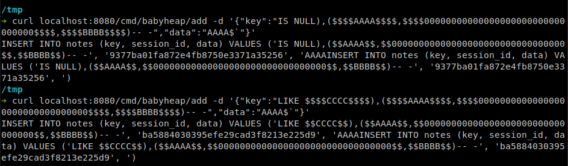
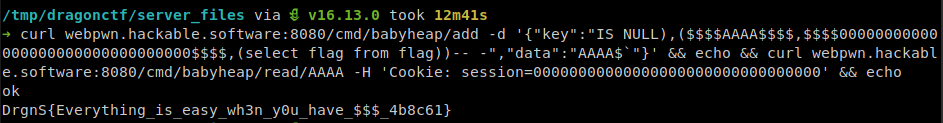

+++
title = "DragonCTF 2021 Writeup"
description = "DragonCTF 2021 Writeup for Web challenge -- webpwn"
date = 2021-11-28T17:46:54+05:30
featured = false
draft = true
comment = false
toc = true
reward = false
categories = [
  "ctf"
]
tags = [
  "ctfs",
  "writeups",
  "web"
]
series = []
images = ["images/DragonCTF.png"]
+++

I have played [DragonCTF 2021](https://ctftime.org/event/1457) with team [Water Paddlers](https://ctftime.org/team/155019). We ended up at #7 worldwide.  
I solved 1 web challange -- webpwn along with my teammates [@rekter0](https://twitter.com/rekter0), [@PewGrand](https://twitter.com/PewGrand) and [@ZeddYu_Lu](https://twitter.com/ZeddYu_Lu).

<!--more-->

## Webpwn [283/500] (18 solves)


&nbsp;&nbsp;&nbsp;&nbsp;We are given a website -- [http://webpwn.hackable.software:8080](http://webpwn.hackable.software:8080) that looks like a shell. It has some basic commands like ls, cat, id, etc. The frontend of the website parses the command and sends respective api requests to get the data from the server.



&nbsp;&nbsp;&nbsp;&nbsp;If we observe the api requests from developer tools or burp proxy, we can notice the **cat** and **ls** commands send post requests to **/cmd/cat** and **/cmd/ls** with argument as post data. We can use that to do **ls ..** and using those filenames, we can cat all the files and save them locally. 

<pre>
mkdir server_files/
for i in $(curl -XPOST webpwn.hackable.software:8080/cmd/ls -d '..' --output -)
do
    curl -XPOST webpwn.hackable.software:8080/cmd/cat -d "../${i}" > server_files/$i
done
</pre>

```js
function sqlEscape(value) {
    return "'" + String(value).replace(/[^\x20-\x7e]|[']/g, '') + "'";
}

function prepare(query, params) {
    for (const key in params) {
            query = query.replaceAll(':' + key, sqlEscape(params[key]));
    }
    return query;
}

/*
prepare("SELECT * FROM notes WHERE session_id = :sid AND key = :key", {
    "sid": req.cookies["session"],
    "key": key
});
*/
```

&nbsp;&nbsp;&nbsp;&nbsp;After reading the [source code](files/server_files.zip) of the server, we can see that the author used custom function to make prepared statements which uses **`sqlEscape`** function. So, SQL injection is possible, if we can escape from the single quotes. And we can confirm that flag is in database by looking at the [schema.sql](files/schema.sql). But the input that is being sent to the sqlEscape function is checked against some regex to make sure that it is safe & secure.

&nbsp;&nbsp;&nbsp;&nbsp;The data passed to sqlEscape function can be controlled by several user inputs, but all of them have regex checks. The user controlled inputs and their regex checks are,

1. req.cookies['session']: It should match with /^[a-f0-9]{32}\$/. It is very strict and not so useful for us!
2. key: It should match with /^[A-Za-z][ -9A-Za-z]+\$/. It is flexible, but cannot be used to escape out of single quotes, because single quote is filter by the sqlEscape function.

[+] sqlEscape replaces any substring that matches with /[^ -~]|[']/g with empty string. The supported characters are quite extensive, but the single quote is clearly specified to be removed.

&nbsp;&nbsp;&nbsp;&nbsp;The post request route `/cmd/babyheap/add/` in babyheap.js has an extra parameter "data", which doesn't have any regex restrictions. But, then again we're stuck with the regex check in sqlEscape.

&nbsp;&nbsp;&nbsp;&nbsp;I tried serveral other methods to exploit the given api routes to list and read files, but no use. I setup postgresql and ran the server locally and used console.log to check for errors and debugging. After a while, I tried to bruteforce and check if any of the possible characters for sqlEscape can escape from the single quotes and wrote a loop in python to check it.

```py3
import requests, json
for i in range(32, 127):
    print(i, requests.post(
      'http://localhost:8080/cmd/babyheap/add/',
      headers = {'Cookie': 'session=12341234123412341234123412341234', 'Content-Type': 'application/x-www-form-urlencoded'},
      data = json.dumps({'key': 'test' + str(i), 'data': 'testing_data_' + chr(i)})
      ).text
    )
```

&nbsp;&nbsp;&nbsp;&nbsp;The output came like this...
```
32 ok
33 ok
34 ok
35 ok
36 Internal error
37 ok
38 ok
...
125 ok
126 ok
```

&nbsp;&nbsp;&nbsp;&nbsp;Then I manually checked why the ` $ ` character is giving Internal error and found that `replaceAll()` used in prepare function in db.js, is having some weird functionality implementation. Check [this](https://developer.mozilla.org/en-US/docs/Web/JavaScript/Reference/Global_Objects/String/replaceAll#description) out. 



&nbsp;&nbsp;&nbsp;&nbsp;Now, we can use this functionality to get SQL injection in the insert query, as the data from the user input is only being checked against one regex, which allows most of the ASCII characters (0x20-0x7e except '). I have used res.send(query) to check how the query is generated based on data.



We get postgres syntax errors if we send **\$** or **\$\`** at the end of the data string as in the above image. Now we have to craft a payload that doesn't raise sql error and inserts flag into the table. I have tried so many things, but nothing seems to be useful. My teammate [@rekter0](https://twitter.com/rekter0) used **\$\`** to escape out of quotes and postgres keyword to correct the syntax error.



The above payload inserts two new rows into the notes table, one with current session_id, given key and data and another one with session_id 00000000000000000000000000000000, key as AAAA and data as BBBB. So we can use an inner query to read the flag and put it in data column of newly inserted row and send another request with above session_id and key to get the flag.

**Final payload:**  
```bash
curl webpwn.hackable.software:8080/cmd/babyheap/add -d '{"key":"IS NULL),($$$$AAAA$$$$,$$$$00000000000000000000000000000000$$$$,(select flag from flag))-- -","data":"AAAA$`"}' && echo && curl webpwn.hackable.software:8080/cmd/babyheap/read/AAAA -H 'Cookie: session=00000000000000000000000000000000' && echo
```



<!--  <pre>test</pre>  -->
---

##### Thanks for reading! {align=center}