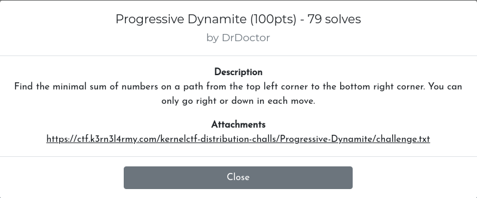
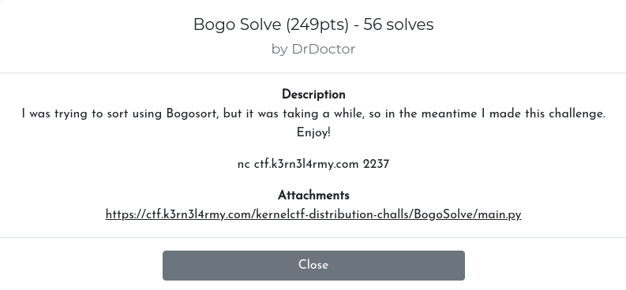
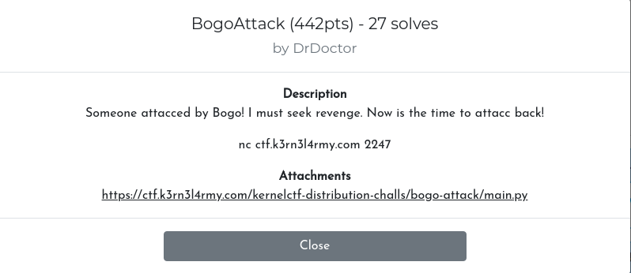

+++
title = "KernelCTF 2021 Writeups"
description = "KernelCTF 2021 Writeups for Bogo Solve, Bogo Attack and Progressive Dynamite"
date = 2021-11-17T19:16:01+05:30
featured = true
draft = false
comment = false
toc = true
reward = false
categories = [
  "ctf"
]
tags = [
  "ctf", 
  "ctfs", 
  "writeup", 
  "writeups",
  "misc"
]
series = []
images = ["images/kernelctf.png"]
+++

Hey, there! After a looong gap, I'm back to CTFs.  
I have played [KernelCTF 2021](https://ctftime.org/event/1438) with team [zh3r0](https://ctftime.org/team/116018). We ended up at #9 worldwide.  
I solved 3 Misc challenges -- Progressive Dynamite, Bogo Solve & Bogo Attack. 

<!--more-->

## 1. Progressive Dynamite [100/500] (79 solves)



&nbsp;&nbsp;&nbsp;&nbsp;As mentioned above, the challenge is pretty simple. We were given a [challenge.txt](files/progressive_dynamite/challenge.txt). It is a 2D matrix of size 100x100 with very big integers and we have to find a way from top left to bottom right, by moving only bottom or right at a time, such that the total sum of number along the way is as low as possible.

&nbsp;&nbsp;&nbsp;&nbsp;For people who are good at competitive coding, this will challenge will be piece of cake. Luckily, I have some experience with some algorithm techniques like divide and conquer, dynamic programming, etc., and I have used dynamic programming to solve this problem.

Solution: [progressive_dynamite_solve.py](files/progressive_dynamite/solve.py)

```py3
from Crypto.Util.number import long_to_bytes # pip3 install pycrypto

with open('challenge.txt') as f: l = eval(f.read())

dp = list([list([-1 for x in range(100)]) for x in range(100)])

def solve(l, i, j):
	if dp[i][j] != -1: return dp[i][j]
	if i == len(l) - 1:
		return sum(l[i][j:])
	if j == len(l) - 1:
		return sum(x[j] for x in l[i:])
	dp[i][j] = l[i][j] + min(solve(l, i+1, j), solve(l, i, j+1))
	return dp[i][j]

x = solve(l, 0, 0)
x -= 38396724472483865997960720090198028896
print('Flag:', long_to_bytes(x).decode())
```

&nbsp;&nbsp;&nbsp;&nbsp;Here, the total no.of possibilities that have to be checked to solve this problem is,
$$
  \dfrac{(99 + 99)!}{99! * 99!} = 2.275 * 10^{58}
$$

&nbsp;&nbsp;&nbsp;&nbsp;But the trick here is, all those possibilities have common sub parts that are evaluated repetatively and unnecessarily. These parts are eliminated in dynamic programming approach, where once a part is evaluated, it is stored in a data structure and when the part is called in another possibility, the stored value is used, instead of calculating it again.

&nbsp;&nbsp;&nbsp;&nbsp;In this way, the time complexity is reduced to `O(mn)` (no.of distinct function calls possible), when m & n are parameters of function, i.e., O(100*100) and space complexity becomes `O(mn)`.

ps: After getting the minimal sum, I had to subtract the first number in order to get the correct flag.

Flag: `flag{dyn4m1c_pr0gramm1ng_pr0!}`

---

## 2. Bogo Solve [249/500] (56 solves)



&nbsp;&nbsp;&nbsp;&nbsp;We were given a netcat connection and a python program which is running behind that netcat connection. The given [main.py](files/bogo_solve/main.py) is,

```py3
import random
NUMS = list(range(10**4))
random.shuffle(NUMS)
tries = 15 # Basically useless, not decremented anywhere!!!
while True:
    try:
        n = int(input('Enter (1) to steal and (2) to guess: '))
        if n == 1:
            if tries==0: # Unreachable condition
                print('You ran out of tries. Bye!')
                break
            l = map(int,input('Enter numbers to steal: ').split(' '))
            output = []
            for i in l:
                assert 0<= i < len(NUMS)
                output.append(NUMS[i])
            random.shuffle(output)
            print('Stolen:',output)
        elif n == 2:
            l = list(map(int,input('What is the list: ').split(' ')))
            if l == NUMS:
                print(open('flag.txt','r').read())
                break
            else:
                print('NOPE')
        else:
            print('Not a choice.')
    except:
        print('Error. Nice Try...')
```

&nbsp;&nbsp;&nbsp;&nbsp;So, what the program does is, it takes list of numbers from 0 to 10,000 and shuffles them. After that, it takes input from the user, a list of space seperated indices, and if the indices are valid (exists b/w 0 - 10**4), the numbers at those indices are shuffled and returned to the user. We have to guess the correct order of 10\*\*4 numbers and send it to server to get the flag.

&nbsp;&nbsp;&nbsp;&nbsp;The problem here is, the 2nd shuffle before giving the numbers. Since the numbers are shuffled, if we take more than one index at a time, we won't be able to recognise the original index of the number. With this in mind, we can try to get all the numbers one by one, by sending one index at a time, from 0 to 10,000. I quickly wrote the script for that, and it didn't work! It keeps stopping at 140-150 iterations. Apparently, the server has a certain limit for no.of requests or certain time to keep the connection open.

&nbsp;&nbsp;&nbsp;&nbsp;So, we have to find another way to get all the numbers with significantly less no.of requests. The next day, after staring at the code for an hour, I got an idea. The idea is,

> 1. Send indices 0 1 1 2 2 2 3 3 3 3 ... to the server  
> 2. From the returned list, based on the count of each number, place it in a dictionary, with count as key and number as value
> 3. Now, repeat the process 100 times, each time sending 100 indices.

Solution: [bogo_solve.py](files/bogo_solve/solve.py)

```py3
from pwn import *

conn = remote('ctf.k3rn3l4rmy.com', '2237')
l = [b'' for _ in range(10**4)]

def get_flag(conn, l):
	conn.sendline(b'2')
	conn.recvuntil(b': ')
	conn.sendline(b' '.join(l))
	print(conn.recvuntil(b'}'))

def get_num(conn, indexes):
	conn.sendline(b'1')
	conn.sendline(indexes.encode())
	p = conn.recvuntil(b'\n')[70:-2]
	return p.split(b', ')

def solve():
	for i in range(100):
		s = ''
		for j in range(100): 
			s += ' '.join(str(i*100 + j) for _ in range(j + 1)) + ' '
		ll = get_num(conn, s[:-1])
		d = {}
		for x in ll: d[ll.count(x)] = x
		for x in d:
			l[i*100 + x - 1] = d[x]
		print(l.count(b''))

solve()
get_flag(conn, l)
```

ps: This isn't the intended solution. You can find the intended solution [here](#intended-solution)

Flag: `flag{alg0r1thms_ar3_s0_c00l!}`

---

## 3. Bogo Attack [442/500] (27 solves)



```py3
import random
NUMS = list(range(10**4))
random.shuffle(NUMS)
tries = 15
while True:
    try:
        n = int(input('Enter (1) to steal and (2) to guess: '))
        if n == 1:
            if tries==0:
                print('You ran out of tries. Bye!')
                break
            l = map(int,input('Enter numbers to steal: ').split(' '))
            output = []
            for i in l:
                assert 0<= i < len(NUMS)
                output.append(NUMS[i])
            random.shuffle(output)
            print('Stolen:',output)
            tries-=1 # tries decremented, so we got only 15 tries
        elif n == 2:
            l = list(map(int,input('What is the list: ').split(' ')))
            if l == NUMS:
                print(open('flag.txt','r').read())
                break
            else:
                print('NOPE')
                break
        else:
            print('Not a choice.')
    except:
        print('Error. Nice Try...')
```

It is same as the [Bogo Solve](#2-bogo-solve-249500-56-solves) challenge, but the trails variable is decremented this time, so we have to do it in lesser no.of tries (15 tries only). So initially I tried to send "0 1 1 2 2 2 ... 1000 (1000 times)", but it failed because the data to be sent for each request is over 1mb. Stuck there for an hour or so.

After some time, I got another idea.

> 1. I first used one try to get all the numbers in even indices.
> 2. Then I send "0 1 2 2 3 3 4 4 4 5 5 5 ..." and we get 0th index and 1st index number 1 time. So we don't know which it at which index.
> 3. For that, we can use even list we got earlier. If the number that repeats only 1 time is in even list, then it is of 0th index, otherwise 1st index and so on.

In this way, I used 14 tries, 716 numbers each time, to get the full list of numbers.

Solution: [bogo_attack_solve.py]()

ps: This isn't the intended solution. You can find the intended solution [here](#intended-solution)

Flag: `flag{m0d1f13d_b1n4ry_s34rch!}`

## Intended solution

The intended solution is pretty awesome. I would have never thought of that. The intended way involves little bit of set theory.

1. First we get all the indexes that has 0 in their 1st bit (MSB) and steal the numbers and store it in an array S0, then get indexes that has 0 in their 2nd bit and store the stolen numbers in set S1, and so on.
2. Now, if we want a number at an index, say at index 10 (0b000000000001010), all we have to do is 
$$
  S0 \cap S1 \cap S2 \cap ... \cap S11' \cap S12 \cap S13' \cap S14
$$

3. Since the numbers are only 10\*\*4 ( < 2\*\*15 ), 15 requests are enough for this method. In this way, we get all the sets and perform these operations 10\*\*4 times to get the correct list and submit it to get the flag.